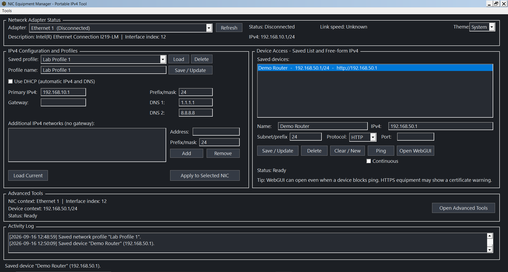
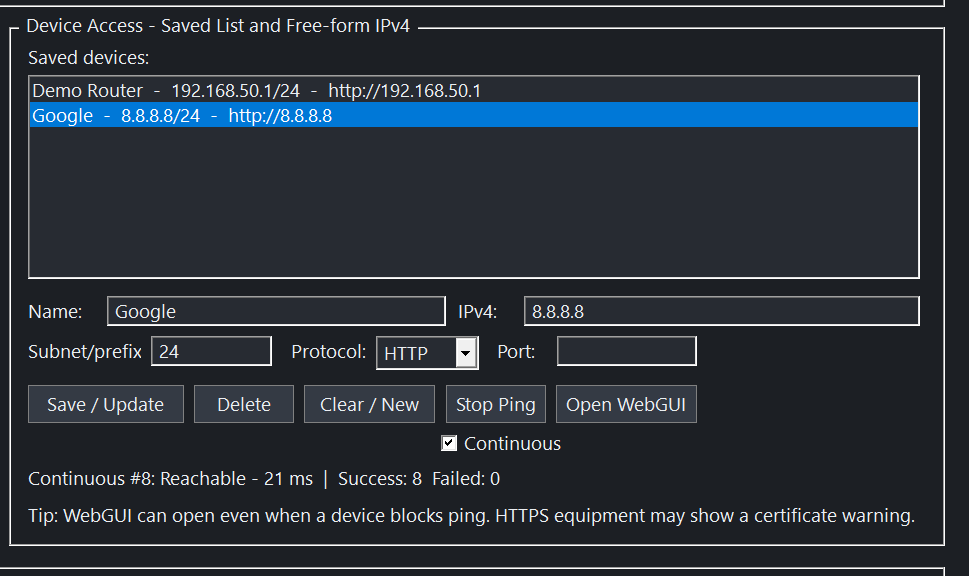
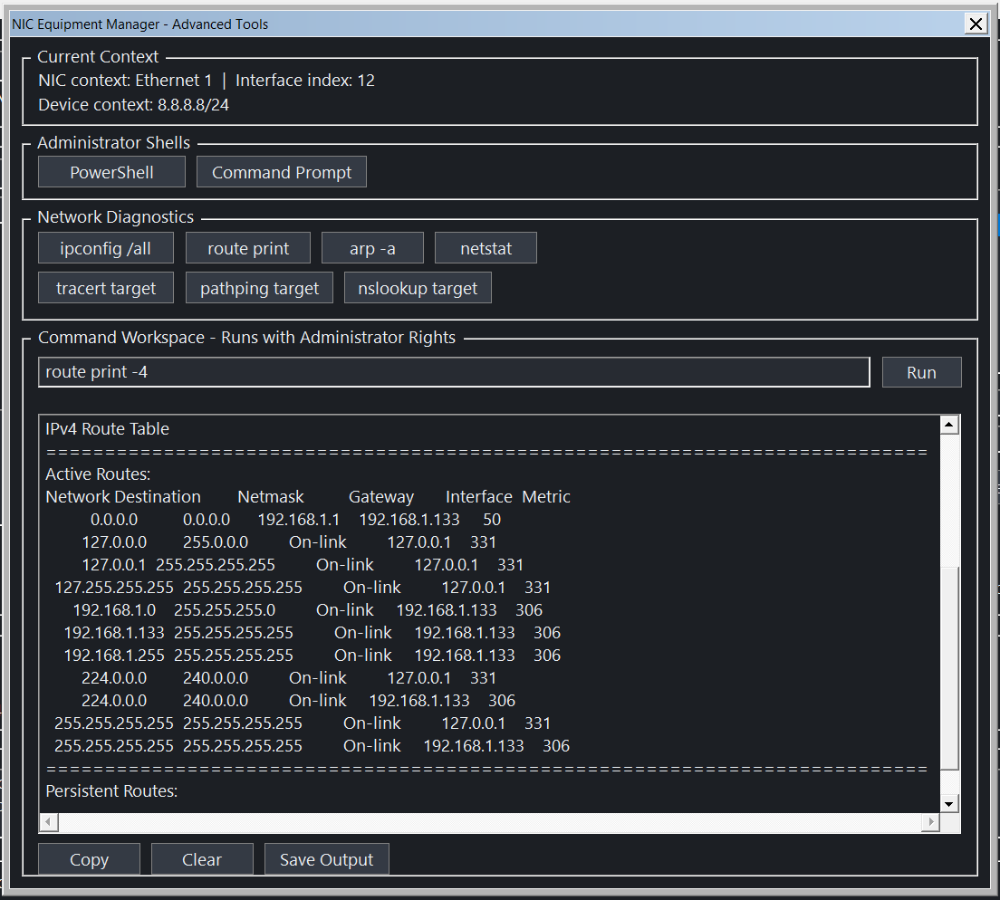
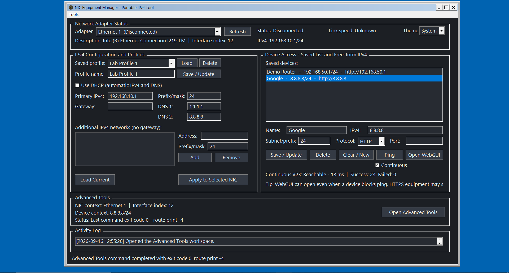
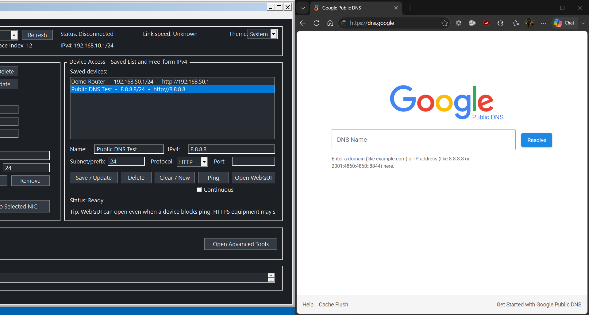

# NIC Equipment Manager — Portfolio Case Study

## Overview

I developed **NIC Equipment Manager** to solve a recurring Windows networking problem in my own workflow. A laptop with multiple network interfaces regularly needed to move between different IPv4 configurations, and repeatedly navigating Windows network settings made a simple task slower and more error-prone than it needed to be.

Rather than continue performing the same sequence manually, I turned the workflow into a focused native Windows utility.

## The problem

The original workflow involved repeatedly identifying the correct network adapter, checking its current state, switching between DHCP and static addressing, entering IPv4/mask/gateway/DNS values, maintaining additional equipment-network addresses, and launching separate Windows tools for diagnostics.

Windows could already perform all of those tasks, and experienced users can often navigate them quickly from memory. The problem was that the workflow was fragmented, repetitive, and unnecessarily dependent on knowing where every setting, command, and shortcut lived.

## Why build this at all?

Windows already provides all of the tools needed to configure network adapters and run diagnostics, and an experienced technician can usually move through them quickly from memory. My goal was not to replace those tools, but to make the workflow more accessible and efficient.

I wanted one place where I could handle the repetitive tasks I use most often without relying on memorized shortcuts, command syntax, or jumping between multiple Windows utilities. That same approach also makes the tool useful for someone newer to IT who may understand the networking concepts but has not yet built up the muscle memory that comes from performing the same tasks hundreds of times.

In that sense, NIC Equipment Manager is both a productivity tool and a workflow aid: it reduces friction for experienced users while making common network-management tasks easier to approach for less-experienced users.

## The solution

NIC Equipment Manager consolidates those recurring configuration and diagnostic tasks into a single desktop interface. It provides reusable NIC profiles, saved device targets, adapter-state information, IPv4 configuration, ping testing, browser launching, an activity log, and a separate Advanced Tools workspace for deeper diagnostics.

The design goal is intentionally narrow: **make repeated network-interface work faster, clearer, and easier to verify without trying to replace every Windows networking function.**

## Key capabilities

### IPv4 configuration and reusable profiles

- Enumerates Windows network interfaces.
- Shows connection state, interface index, assigned IPv4 addresses, and link speed.
- Switches selected adapters between DHCP and static IPv4 configuration.
- Supports primary IPv4 address, prefix/mask, optional gateway, DNS servers, and additional IPv4 networks.
- Saves and reloads reusable network profiles.
- Handles disconnected NICs so addresses can be staged before equipment is physically connected.

### Saved device access and continuous testing

- Stores named device targets locally.
- Supports IPv4, prefix, HTTP/HTTPS, and optional port values.
- Performs one-time and continuous ping testing.
- Tracks success/failure totals and current response time.
- Opens a target's configured web interface in the default browser.

### Advanced diagnostics

A separate resizable Advanced Tools workspace provides:

- Administrator PowerShell and Command Prompt launchers.
- `ipconfig /all`, IPv4 route, ARP, and netstat presets.
- Target-aware tracert, pathping, and nslookup.
- An elevated free-form command workspace.
- Captured output with Copy, Clear, and Save Output controls.
- Correct repainting during vertical/horizontal scrolling of long command output.

### Resizable native Windows interface

The application supports resizing and maximizing while preserving aligned controls, readable section headers, and usable diagnostic/status areas.

### Browser-launch workflow proof

Saved web targets can be opened directly from Device Access. Public demo data is used in portfolio material rather than any work-specific network details.

## Engineering challenges addressed

### Verifying state instead of trusting exit codes

Real hardware testing exposed an important Windows edge case: a command could return successfully while Windows did **not** actually transition a disconnected adapter from DHCP to static configuration.

Investigation showed that Windows could retain the persistent TCP/IP `EnableDHCP` value even after higher-level networking commands appeared to succeed. The final implementation handles both the live interface state and the persistent DHCP state, then reads Windows back before reporting success.

That changed the implementation philosophy from **“the command returned success”** to **“the requested state was verified.”**

### Disconnected adapters

A central use case is pre-staging a network interface before connecting equipment. Testing therefore included disconnected physical adapters rather than assuming an active network link.

### DPI, resizing, and dark-theme rendering

Development addressed Windows-specific UI issues including DPI scaling, maximized-window clipping, aligned moving columns, minimum usable sizing, dark-theme section-header rendering, and stale-text repaint artifacts in a scrolling multiline output control.

### Link-speed edge cases

Windows can expose sentinel/invalid link-speed values on disconnected interfaces. These are filtered and presented as `Unknown` rather than misleading multi-billion-Gbps values.

## Development process

The project originated from a real recurring problem rather than a hypothetical tutorial exercise. Development followed an iterative cycle:

1. Identify a repetitive or failure-prone step.
2. Define the expected Windows state after the operation.
3. Implement the behavior.
4. Test against real adapters.
5. Compare the application's result with native Windows tools.
6. Correct discrepancies and add regression coverage.

AI-assisted development tools were used to accelerate implementation, debugging, and documentation. Requirements, workflow decisions, testing, acceptance, and final behavioral verification were driven by hands-on use.

## Result

NIC Equipment Manager turns a multi-step Windows networking workflow into a focused utility while retaining access to deeper diagnostics when needed.

For a prospective client, the project demonstrates the kind of work I want to provide:

> **Identify a repetitive technical process, understand how it is actually performed, build a focused tool around it, and verify that the automation produces the intended system state.**

## Skills demonstrated

Windows desktop application development; networking fundamentals; IPv4 configuration; Windows PowerShell and `netsh` integration; registry/state management; native GUI design; DPI/responsive layout; local persistence; input validation; command capture; troubleshooting; iterative debugging; regression testing; packaging; workflow automation.

## Public-use note

This case study intentionally excludes organization-specific infrastructure, equipment, addresses, network topology, locations, and operational details. All screenshots use generic/home-lab demonstration data.
